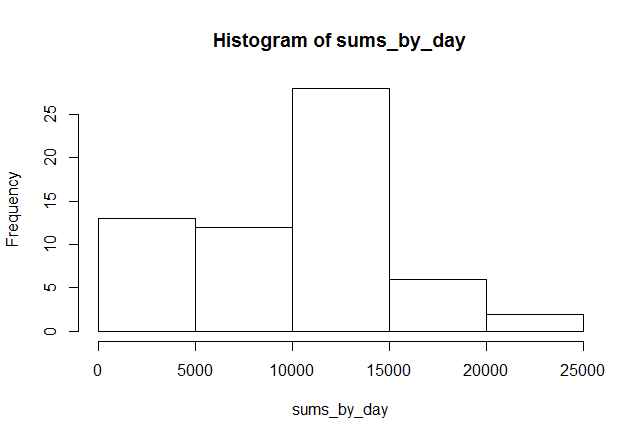
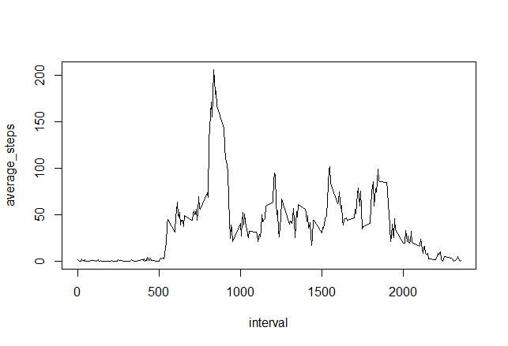
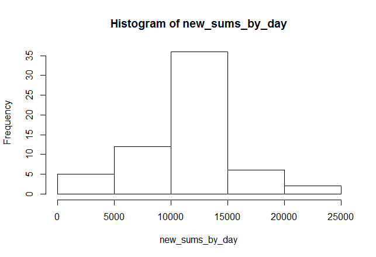
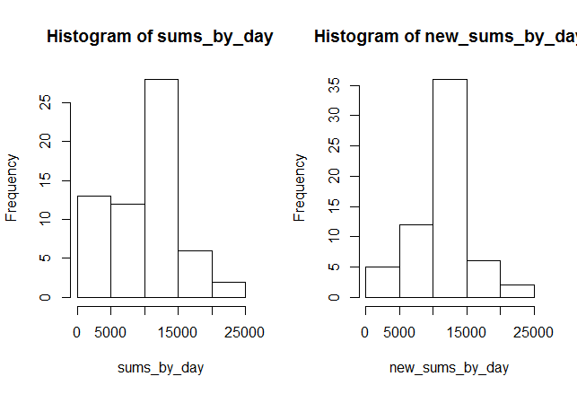
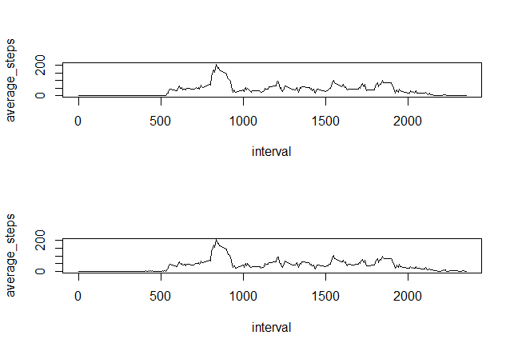

## Loading and preprocessing the data

### 1) Load the data


```r
data<-read.csv("D://R/input/coursera/activity.csv");
```

### 2) Process/transform the data (if necessary) into a format suitable for your analysis

This step was not necessary.

## What is mean total number of steps taken per day?

### 1) Calculate the total number of steps taken per day
We use tapply for this step. option na.rm is set to TRUE because data$steps contains
NA values.


```r
sums_by_day<-tapply(data$steps,data$date,sum,na.rm=TRUE);
sums_by_day[is.na(sums_by_day)]<-0;
```

### 2) Make a histogram of the total number of steps taken each day


```r
hist(sums_by_day);
```



### 3) Calculate and report the mean and median of the total number of steps taken per day
The means is computed by the following instructions:


```r
means_by_day<-tapply(data$steps,data$date,mean,na.rm=TRUE);
means_by_day[is.na(means_by_day)]<-0;
print(means_by_day);
```

```
## 2012-10-01 2012-10-02 2012-10-03 2012-10-04 2012-10-05 2012-10-06 
##  0.0000000  0.4375000 39.4166667 42.0694444 46.1597222 53.5416667 
## 2012-10-07 2012-10-08 2012-10-09 2012-10-10 2012-10-11 2012-10-12 
## 38.2465278  0.0000000 44.4826389 34.3750000 35.7777778 60.3541667 
## 2012-10-13 2012-10-14 2012-10-15 2012-10-16 2012-10-17 2012-10-18 
## 43.1458333 52.4236111 35.2048611 52.3750000 46.7083333 34.9166667 
## 2012-10-19 2012-10-20 2012-10-21 2012-10-22 2012-10-23 2012-10-24 
## 41.0729167 36.0937500 30.6284722 46.7361111 30.9652778 29.0104167 
## 2012-10-25 2012-10-26 2012-10-27 2012-10-28 2012-10-29 2012-10-30 
##  8.6527778 23.5347222 35.1354167 39.7847222 17.4236111 34.0937500 
## 2012-10-31 2012-11-01 2012-11-02 2012-11-03 2012-11-04 2012-11-05 
## 53.5208333  0.0000000 36.8055556 36.7048611  0.0000000 36.2465278 
## 2012-11-06 2012-11-07 2012-11-08 2012-11-09 2012-11-10 2012-11-11 
## 28.9375000 44.7326389 11.1770833  0.0000000  0.0000000 43.7777778 
## 2012-11-12 2012-11-13 2012-11-14 2012-11-15 2012-11-16 2012-11-17 
## 37.3784722 25.4722222  0.0000000  0.1423611 18.8923611 49.7881944 
## 2012-11-18 2012-11-19 2012-11-20 2012-11-21 2012-11-22 2012-11-23 
## 52.4652778 30.6979167 15.5277778 44.3993056 70.9270833 73.5902778 
## 2012-11-24 2012-11-25 2012-11-26 2012-11-27 2012-11-28 2012-11-29 
## 50.2708333 41.0902778 38.7569444 47.3819444 35.3576389 24.4687500 
## 2012-11-30 
##  0.0000000
```

The median is computed by the following instructions:


```r
medians_by_day<-tapply(data$steps,data$date,median,na.rm=TRUE);
medians_by_day[is.na(medians_by_day)]<-0;
print(medians_by_day);
```

```
## 2012-10-01 2012-10-02 2012-10-03 2012-10-04 2012-10-05 2012-10-06 
##          0          0          0          0          0          0 
## 2012-10-07 2012-10-08 2012-10-09 2012-10-10 2012-10-11 2012-10-12 
##          0          0          0          0          0          0 
## 2012-10-13 2012-10-14 2012-10-15 2012-10-16 2012-10-17 2012-10-18 
##          0          0          0          0          0          0 
## 2012-10-19 2012-10-20 2012-10-21 2012-10-22 2012-10-23 2012-10-24 
##          0          0          0          0          0          0 
## 2012-10-25 2012-10-26 2012-10-27 2012-10-28 2012-10-29 2012-10-30 
##          0          0          0          0          0          0 
## 2012-10-31 2012-11-01 2012-11-02 2012-11-03 2012-11-04 2012-11-05 
##          0          0          0          0          0          0 
## 2012-11-06 2012-11-07 2012-11-08 2012-11-09 2012-11-10 2012-11-11 
##          0          0          0          0          0          0 
## 2012-11-12 2012-11-13 2012-11-14 2012-11-15 2012-11-16 2012-11-17 
##          0          0          0          0          0          0 
## 2012-11-18 2012-11-19 2012-11-20 2012-11-21 2012-11-22 2012-11-23 
##          0          0          0          0          0          0 
## 2012-11-24 2012-11-25 2012-11-26 2012-11-27 2012-11-28 2012-11-29 
##          0          0          0          0          0          0 
## 2012-11-30 
##          0
```

## What is the average daily activity pattern?

### 1) Make a time series plot of the 5-minute interval (x-axis) and the average number of steps taken, averaged across all days (y-axis)

First, we compute the average number of steps taken each 5-minute interval.


```r
means_by_int<-tapply(data$steps,data$interval,mean,na.rm=TRUE);
means_by_int[is.na(means_by_int)]<-0;
```

Then we plot these values as a time series.


```r
plot(means_by_int ~ unique(data$interval),type="l",
     xlab="interval",ylab="average_steps")
```



### 2) Which 5-minute interval, on average across all the days in the dataset, contains the maximum number of steps?

The 5-minute interval with the maximum averaged number of steps is


```r
names(which.max(means_by_int));
```

```
## [1] "835"
```

In this interval, the mean value is


```r
print(means_by_int[which.max(means_by_int)]);
```

```
##      835 
## 206.1698
```

## Imputing missing values

### 1) Calculate and report the total number of missing values in the dataset


```r
nrow(data) - sum(complete.cases(data))
```

```
## [1] 2304
```

### 2) Devise a strategy for filling in all of the missing values in the dataset. The strategy does not need to be sophisticated. For example, you could use the mean/median for that day, or the mean for that 5-minute interval, etc.

We opt to fill missing values using the mean for the corresponding 5-minute interval, as shown in the next step.

### 3) Create a new dataset that is equal to the original dataset but with the missing data filled in.


```r
new_data<-data;
new_data$steps[is.na(data$steps)]<-means_by_int[as.character(data$interval[is.na(data$steps)])]
```

### 4) Make a histogram of the total number of steps taken each day and Calculate and report the mean and median total number of steps taken per day. Do these values differ from the estimates from the first part of the assignment? What is the impact of imputing missing data on the estimates of the total daily number of steps?

The total number of steps taken each day is


```r
new_sums_by_day<-tapply(new_data$steps,new_data$date,sum,na.rm=TRUE);
new_sums_by_day[is.na(new_sums_by_day)]<-0;
```

The histogram for these values is


```r
hist(new_sums_by_day);
```



the mean of steps taken per day is computed by the following instructions:


```r
new_means_by_day<-tapply(new_data$steps,new_data$date,mean,na.rm=TRUE);
new_means_by_day[is.na(new_means_by_day)]<-0;
print(new_means_by_day);
```

```
## 2012-10-01 2012-10-02 2012-10-03 2012-10-04 2012-10-05 2012-10-06 
## 37.3825996  0.4375000 39.4166667 42.0694444 46.1597222 53.5416667 
## 2012-10-07 2012-10-08 2012-10-09 2012-10-10 2012-10-11 2012-10-12 
## 38.2465278 37.3825996 44.4826389 34.3750000 35.7777778 60.3541667 
## 2012-10-13 2012-10-14 2012-10-15 2012-10-16 2012-10-17 2012-10-18 
## 43.1458333 52.4236111 35.2048611 52.3750000 46.7083333 34.9166667 
## 2012-10-19 2012-10-20 2012-10-21 2012-10-22 2012-10-23 2012-10-24 
## 41.0729167 36.0937500 30.6284722 46.7361111 30.9652778 29.0104167 
## 2012-10-25 2012-10-26 2012-10-27 2012-10-28 2012-10-29 2012-10-30 
##  8.6527778 23.5347222 35.1354167 39.7847222 17.4236111 34.0937500 
## 2012-10-31 2012-11-01 2012-11-02 2012-11-03 2012-11-04 2012-11-05 
## 53.5208333 37.3825996 36.8055556 36.7048611 37.3825996 36.2465278 
## 2012-11-06 2012-11-07 2012-11-08 2012-11-09 2012-11-10 2012-11-11 
## 28.9375000 44.7326389 11.1770833 37.3825996 37.3825996 43.7777778 
## 2012-11-12 2012-11-13 2012-11-14 2012-11-15 2012-11-16 2012-11-17 
## 37.3784722 25.4722222 37.3825996  0.1423611 18.8923611 49.7881944 
## 2012-11-18 2012-11-19 2012-11-20 2012-11-21 2012-11-22 2012-11-23 
## 52.4652778 30.6979167 15.5277778 44.3993056 70.9270833 73.5902778 
## 2012-11-24 2012-11-25 2012-11-26 2012-11-27 2012-11-28 2012-11-29 
## 50.2708333 41.0902778 38.7569444 47.3819444 35.3576389 24.4687500 
## 2012-11-30 
## 37.3825996
```


the median of steps taken per day is computed by the following instructions:


```r
new_medians_by_day<-tapply(new_data$steps,new_data$date,median,na.rm=TRUE);
new_medians_by_day[is.na(new_medians_by_day)]<-0;
print(new_medians_by_day);
```

```
## 2012-10-01 2012-10-02 2012-10-03 2012-10-04 2012-10-05 2012-10-06 
##   34.11321    0.00000    0.00000    0.00000    0.00000    0.00000 
## 2012-10-07 2012-10-08 2012-10-09 2012-10-10 2012-10-11 2012-10-12 
##    0.00000   34.11321    0.00000    0.00000    0.00000    0.00000 
## 2012-10-13 2012-10-14 2012-10-15 2012-10-16 2012-10-17 2012-10-18 
##    0.00000    0.00000    0.00000    0.00000    0.00000    0.00000 
## 2012-10-19 2012-10-20 2012-10-21 2012-10-22 2012-10-23 2012-10-24 
##    0.00000    0.00000    0.00000    0.00000    0.00000    0.00000 
## 2012-10-25 2012-10-26 2012-10-27 2012-10-28 2012-10-29 2012-10-30 
##    0.00000    0.00000    0.00000    0.00000    0.00000    0.00000 
## 2012-10-31 2012-11-01 2012-11-02 2012-11-03 2012-11-04 2012-11-05 
##    0.00000   34.11321    0.00000    0.00000   34.11321    0.00000 
## 2012-11-06 2012-11-07 2012-11-08 2012-11-09 2012-11-10 2012-11-11 
##    0.00000    0.00000    0.00000   34.11321   34.11321    0.00000 
## 2012-11-12 2012-11-13 2012-11-14 2012-11-15 2012-11-16 2012-11-17 
##    0.00000    0.00000   34.11321    0.00000    0.00000    0.00000 
## 2012-11-18 2012-11-19 2012-11-20 2012-11-21 2012-11-22 2012-11-23 
##    0.00000    0.00000    0.00000    0.00000    0.00000    0.00000 
## 2012-11-24 2012-11-25 2012-11-26 2012-11-27 2012-11-28 2012-11-29 
##    0.00000    0.00000    0.00000    0.00000    0.00000    0.00000 
## 2012-11-30 
##   34.11321
```

Mean and median values change when imputing missing data. This can be clearly seen in their values for the first value of the dataset. If we print the absolute difference between the values with and without imputing data for this we obtain.


```r
print(sprintf("Mean diff: %f",abs(new_means_by_day[1]-means_by_day[1])));
```

```
## [1] "Mean diff: 37.382600"
```

```r
print(sprintf("Median diff: %f",abs(new_medians_by_day[1]-medians_by_day[1])));
```

```
## [1] "Median diff: 34.113208"
```

The total daily number of steps. This can also be seen in its value for the first value of the dataset


```r
print(sprintf("Sum diff: %f",abs(new_sums_by_day[1]-sums_by_day[1])));
```

```
## [1] "Sum diff: 10766.188679"
```

And also in their corresponding histograms


```r
par(mfrow=c(1,2));
hist(sums_by_day);
hist(new_sums_by_day);
```



## Are there differences in activity patterns between weekdays and weekends?

### 1) Create a new factor variable in the dataset with two levels - "weekday" and "weekend" indicating whether a given date is a weekday or weekend day.

First, we create a vector containing the day of the week for all the dates in the dataset.


```r
dates<-as.Date(new_data$date);
day<-weekdays(dates);
```
Then we create a factor vector using this information.


```r
day_factor<-rep("weekday",length(day));
day_factor[((day == "sábado") | (day == "domingo"))]="weekend";
day_factor<-factor(as.character(day_factor),levels=c("weekday","weekend"));
```

### 2) Make a panel plot containing a time series plot (i.e. type = "l") of the 5-minute interval (x-axis) and the average number of steps taken, averaged across all weekday days or weekend days (y-axis).

First we compute the average number of steps for weekday days.


```r
data_weekday<-new_data[day_factor=="weekday",];
new_means_by_int_1<-tapply(data$steps,data$interval,mean,na.rm=TRUE);
new_means_by_int_1[is.na(new_means_by_int_1)]<-0;
```

Then we compute this value for weekend days.


```r
data_weekend<-new_data[day_factor=="weekend",];
new_means_by_int_2<-tapply(data$steps,data$interval,mean,na.rm=TRUE);
new_means_by_int_2[is.na(new_means_by_int_2)]<-0;
```

Finally we compute a panel plot with two rows each one of them containing one figure using these values.


```r
par(mfrow=c(2,1));
plot(new_means_by_int_1 ~ unique(new_data$interval),type="l",
     xlab="interval",ylab="average_steps");
plot(new_means_by_int_2 ~ unique(new_data$interval),type="l",
     xlab="interval",ylab="average_steps");
```


